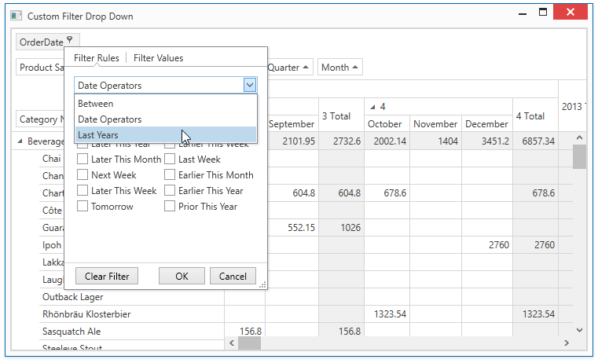

# How to Create a Custom Filter Drop-Down

This example demonstrates how to create the Excel-style filter drop-down, adjust its settings and modify operators available in the Filter Rules tab. If the [PivotGridControl.FieldFilterPopupMode](https://docs.devexpress.com/WPF/DevExpress.Xpf.PivotGrid.PivotGridControl.FieldFilterPopupMode) property is set to **Excel**, all fields have Excel-style filter drop-downs. However, to customize the filter drop-down, you have to use the following approach:

* Create a custom data template that contains the [ExcelStyleFilterElement](https://docs.devexpress.com/WPF/DevExpress.Xpf.Core.FilteringUI.ExcelStyleFilterElement) whose [QueryOperators](https://docs.devexpress.com/WPF/DevExpress.Xpf.Core.FilteringUI.ExcelStyleFilterElement.QueryOperators) event is handled to modify the list of available operators and add a custom operator.

* Assign the data template to the [PivotGridField.CustomFilterPopupTemplate](https://docs.devexpress.com/WPF/DevExpress.Xpf.PivotGrid.PivotGridField.CustomFilterPopupTemplate) property.

> The project requires references to the Devexpress.DataAccess, DevExpress.Xpf.Core.Extensions, DevExpress.Xpf.Grid, DevExpress.Xpf.Grid.Core, Devexpress.Xpf.Grid.Extensions assemblies in addition to references created automatically when the PivotGrid control is dropped from VS Designer Toolbox.

**API in this example:**

* [PivotGridField.CustomFilterPopupTemplate](https://docs.devexpress.com/WPF/DevExpress.Xpf.PivotGrid.PivotGridField.CustomFilterPopupTemplate) property
* [ExcelStyleFilterElement](https://docs.devexpress.com/WPF/DevExpress.Xpf.Core.FilteringUI.ExcelStyleFilterElement) class
* [QueryOperators](https://docs.devexpress.com/WPF/DevExpress.Xpf.Core.FilteringUI.ExcelStyleFilterElement.QueryOperators) event
* [PivotGridControl.FieldFilterPopupMode](https://docs.devexpress.com/WPF/DevExpress.Xpf.PivotGrid.PivotGridControl.FieldFilterPopupMode) property
* [PivotGridControl.ShowOnlyAvailableFilterItems ](https://docs.devexpress.com/WPF/DevExpress.Xpf.PivotGrid.PivotGridControl.ShowOnlyAvailableFilterItem)
* [PivotGridField.ImmediateUpdateFieldFilter](https://docs.devexpress.com/WPF/DevExpress.Xpf.PivotGrid.PivotGridField.ImmediateUpdateFieldFilter) property
* [ExcelStyleFilterElementOperatorItem](https://docs.devexpress.com/WPF/DevExpress.Xpf.Core.FilteringUI.ExcelStyleFilterElementOperatorItem) class
* [ExcelStyleFilterElementOperatorType](https://docs.devexpress.com/WPF/DevExpress.Xpf.Core.FilteringUI.ExcelStyleFilterElementOperatorType) enumeration
* [TextEditSettings](https://docs.devexpress.com/WPF/DevExpress.Xpf.Editors.Settings.TextEditSettings) class
* **ExcelItemsSource** extension

You can use any available filter element in the data template. For the ExcelStyleFilterElement, you can create custom operators or even specify a data editor in an operand template for an operator.

**See also:**

* [Drop-down Filter](https://docs.devexpress.com/WPF/10932)
* [Excel-style Drop-down Filter](https://docs.devexpress.com/WPF/120529)
* [Filter Elements](https://docs.devexpress.com/WPF/400314)
* [Implementing Custom Functions](https://docs.devexpress.com/WindowsForms/9947)
